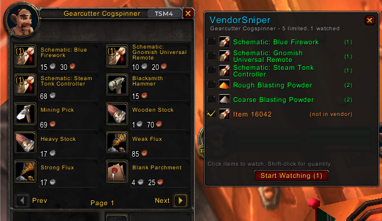

# VendorSniper

[](https://www.curseforge.com/wow/addons/vendorsniper)
[](https://addons.wago.io/addons/vendorsniper)
[](https://opensource.org/licenses/MIT)
[](https://www.paypal.com/donate/?hosted_button_id=FG4KES3HNPLVG)

If you find this useful, consider [supporting development](https://www.paypal.com/donate/?hosted_button_id=FG4KES3HNPLVG).

Other addons:
- [LazyProf](https://www.curseforge.com/wow/addons/lazyprof) - Profession leveling optimizer
- [Silencer](https://www.curseforge.com/wow/addons/silencer-whispers) - Whisper gatekeeper
- [CraftLib](https://www.curseforge.com/wow/addons/craftlib) - Recipe database
- [PickMe](https://www.curseforge.com/wow/addons/pickme) - LFG listing browser
- [EyesOnMe](https://www.curseforge.com/wow/addons/eyesonme) - PvP targeting awareness

Never miss a limited-supply vendor restock again. Park an alt at a vendor, pick the items you want, and VendorSniper auto-buys them the instant they restock.

## Features

**Basic Mode (always on):**
- **Auto-buy on vendor open** - Automatically purchases watched items when you open any vendor
- **Global watchlist** - Watch items across any vendor, persists between sessions
- **Quantity targets** - Set how many you need; VendorSniper tracks progress and stops when complete

**Snipe Mode (`/vs snipe`):**
- **AFK vendor restock loop** - Auto-closes vendor after each visit so an external key-press tool can reopen it
- **Session-only** - Resets on login so it never runs unintentionally
- **Auto-deactivates** - Stops when all watchlist targets are complete

**Both modes:**
- **Raid warning alerts** - Screen flash and looping sound when a purchase is made (toggleable with `/vs alert`)
- **Purchase log** - Track what was bought, when, and from which vendor
- **Minimap button** - Left-click to toggle window

## Screenshots

### Vendor view
Open any vendor with limited-supply items. Check the ones you want to watch.



## Installation

1. Download from [CurseForge](https://www.curseforge.com/wow/addons/vendorsniper) or [Wago](https://addons.wago.io/addons/vendorsniper)
2. Extract to your `Interface/AddOns/` folder
3. Type `/vs` in-game to open

## Usage

### Basic Mode

1. Visit a vendor that sells limited-supply items
2. VendorSniper automatically shows limited items with checkboxes
3. Check items you want to watch (shift-click for custom quantity)
4. Next time you visit any vendor with those items in stock, they are bought automatically
5. A raid warning alert fires on each purchase

**Tip:** Items are bought from any vendor that sells them, not just the one you added them from.

### Snipe Mode Setup

For AFK vendor camping (auto-buy on restock):

1. Add items to watchlist (`/vs watch [item]` or check them at the vendor)
2. Park your alt at the vendor, facing the NPC
3. In WoW: bind **Interact With Target** to a key (e.g. F5) in Options - Keybindings
4. Type `/vs snipe` to activate snipe mode
5. Run an OS script to press your interact key every few seconds (see below)
6. Go AFK - VendorSniper auto-buys when items restock

**macOS:**
```bash
# Press F5 every 5 seconds (F5 = key code 96)
# Adjust key code and sleep interval for your setup
while true; do
    osascript -e 'tell application "System Events" to key code 96'
    sleep 5
done
```

**Windows (AutoHotkey):**
```ahk
; Press F5 every 5 seconds - save as .ahk and run
; Adjust key and interval to match your keybind
; Alternatives: PowerShell, Python, or any key-sending tool
Loop {
    Send, {F5}
    Sleep, 5000
}
```

## Slash Commands

| Command | Description |
|---------|-------------|
| `/vs` | Toggle window |
| `/vs watch [itemlink]` | Add item to watchlist |
| `/vs snipe` | Toggle snipe mode (auto-close for AFK restock loop) |
| `/vs clear` | Clear watchlist |
| `/vs status` | Show status and watched items |
| `/vs log` | Show recent purchase log |
| `/vs alert` | Toggle alert sound/overlay |

## Minimap Button

- **Left-click** - Toggle the VendorSniper window

## Compatibility

Works on Classic Era (1.15.x) and Anniversary Edition (TBC 2.5.5).

## License

MIT - See [LICENSE](LICENSE) for details.
